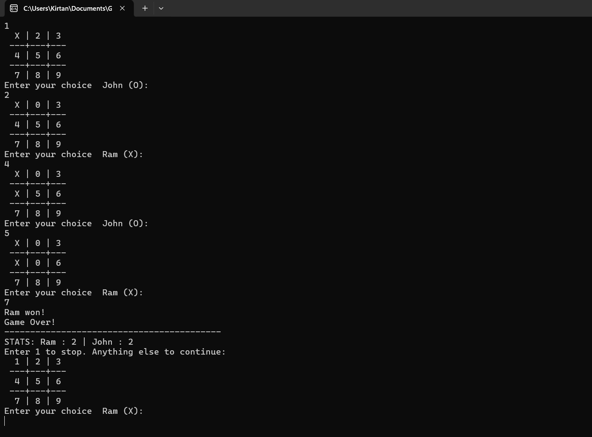
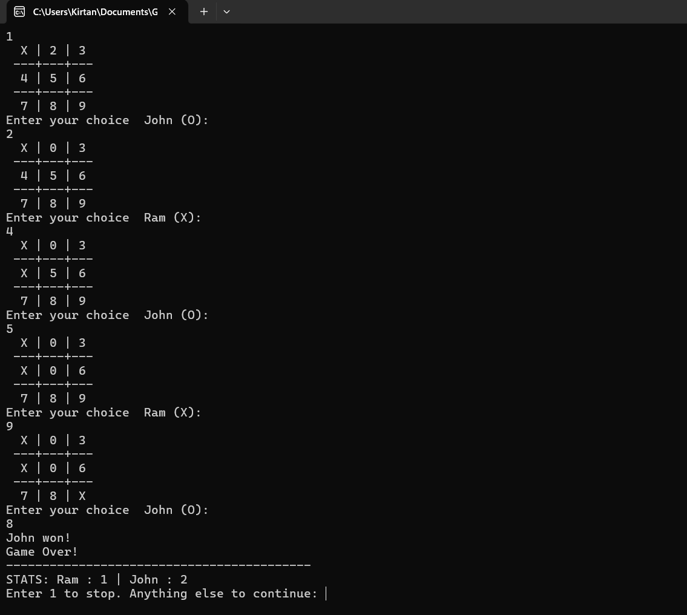
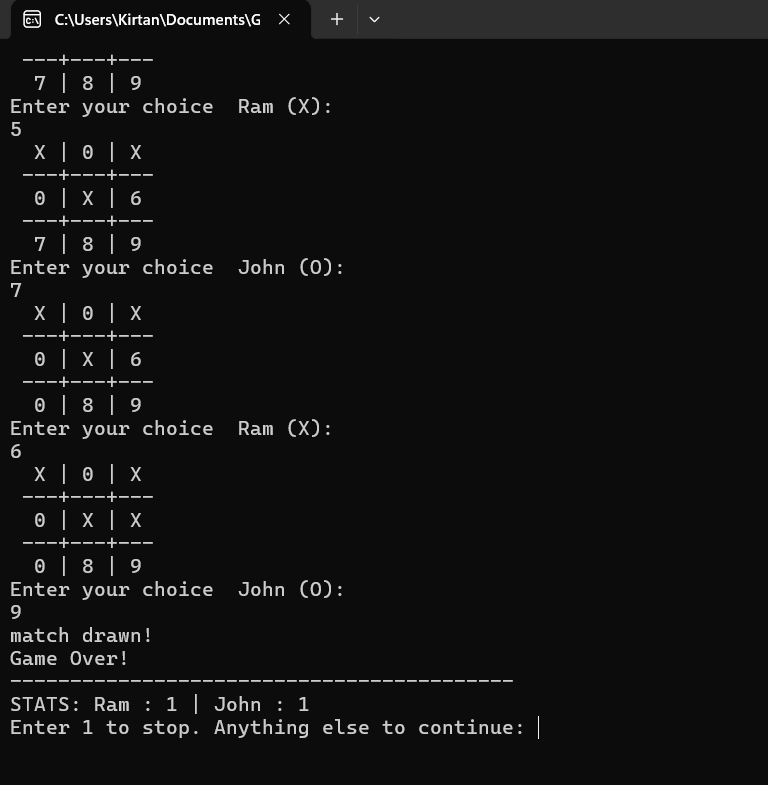

  Tic Tac Toe Console Game

Tic Tac Toe Console Game
========================

A two-player console-based Tic Tac Toe game in C# with a simple interface and win detection.

Features
--------

*   Two-player turn-based gameplay
*   Dynamic board rendering in the console
*   Win detection and draw handling
*   Input validation for a smooth experience

Game Screenshots
----------------

### Player X Wins



### Player O Wins



### Match Drawn



Getting Started
---------------

1.  Clone the repository:
    ```bash
        git clone https://github.com/kirtanshrestha/tic-tac-toe.git
    ```
2.  Open the project in your preferred C# IDE.
3.  Build and run the project.

Technologies Used
-----------------

*   Language: C#
*   Platform: .NET Console Application

Future Enhancements
-------------------

*   Add AI for single-player mode
*   Implement a graphical interface
*   Include sound effects for a better experience

---
### License
This project is licensed under the MIT License. See the [`LICENSE`](LICENSE) file for more details.
